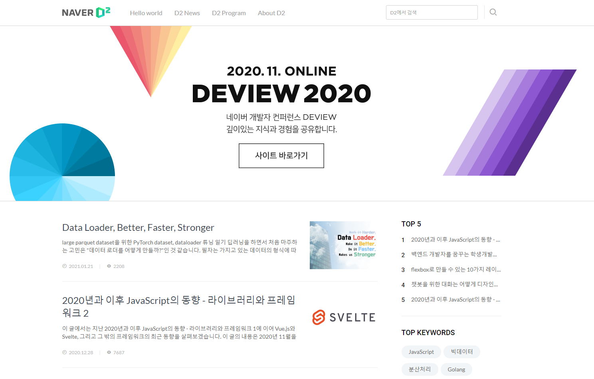

# Naver D2 Clone Coding

> 멀티캠퍼스 사이드 프로젝트 클론 코딩

## 🖼 Main

##  👋 개요

#### - [Naver D2](https://naverd2clone.netlify.app/) 클론 코딩

* [ ] 수업 시간에 배운 html, css, javascript를 바탕으로 Naver D2를 클론 코딩한다.

* [ ] 가장 전형적인 블로그 형태를 가지고 있는 Naver D2 사이트 클론 코딩을 통해 배운 내용을 복습한다.
* [ ] 추후 추가적인 기능(로그인, 시각화 등)을 추가해보며, 이외의 부분을 연습한다.

## 👯‍♂️ Introduction

<table style="text-align: center;">
    <tr><th>프로젝트명</th><th colspan='2'>NAVER D2 Clone Coding</th></tr>
    <tr><th colspan='3' align='center'>구성원</th></tr>
    <tr><th>이름</th><th>역할</th><th>비고</th></tr>
    <tr><td>김은영</td><td>팀장</td><td><a href='https://github.com/rootlessE00'>github</a></td>
    <tr><td>박선익</td><td>팀원</td><td><a href='https://github.com/parksimis'>github</a></td></tr>
	<tr><td>김동현</td><td>팀원</td><td><a href='https://github.com/KIMDONGHYEON003'>github</a></td></tr>
	<tr><th>개발언어</th><td colspan='2'>javascript</td></tr>
	<tr><th>형상관리</th><td colspan='2'>Git, Github</td></tr>
	<tr><th>개발도구</th><td colspan='2 '>Pycharm</td></tr>
</table>

## ⚒ Role

| 구성원 |                업무                |
| :----: | :--------------------------------: |
| 김은영 | 팀장 /  `<aside>` `<content>` 담당 |
| 박선익 |    `<header>` / `<content>`담당    |
| 김동현 |        D2 Program page 담당        |

